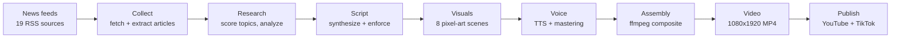
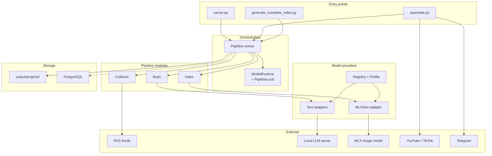
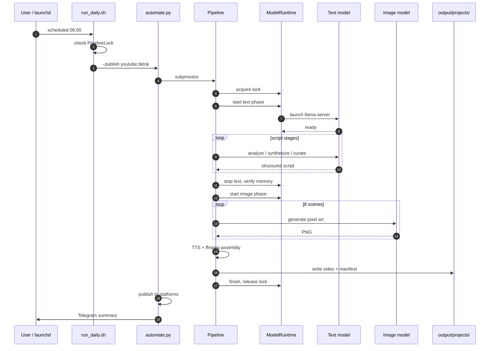

# YT Machine

An automated pipeline that turns global news feeds into short-form vertical
videos: it collects articles, writes a two-story script, generates pixel-art
visuals and a voiceover, composites a 1080×1920 video with `ffmpeg`, and can
publish to YouTube Shorts and TikTok on a daily schedule.

Runs locally on a single machine. The default configuration targets Apple
Silicon with a local LLM and Qwen-Image-2512 through MLX-Gen, so the pipeline
produces video without a hosted image-generation API. Optional cloud backends
(ElevenLabs and OpenAI) are used only when their API keys are present and are
never required for the primary path.

[](LICENSE)
[](requirements-macos.txt)

---

## Overview

Producing a news video by hand is a chain of separate tasks: reading sources,
picking a story, writing to a length, generating visuals, recording narration,
editing, and publishing. YT Machine automates that chain end to end as a staged
pipeline with a checkpointed, inspectable artifact at every step.

**The problem it addresses.** Short-form news production is repetitive and
latency-sensitive — the value of a story decays quickly. The pipeline is built
to run unattended: it wakes the machine, produces the video, publishes it, and
shuts down again.

**What makes it non-trivial.** The pipeline has to run a large language model
and a diffusion image model on a single machine. On Apple Silicon both compete
for one unified memory pool, so the system enforces a strict phase ordering and
verifies that a model's memory has actually been reclaimed before loading the
next one. That constraint shapes most of the architecture.

**Who it is for.** Developers interested in local-first generative media
pipelines, and anyone who wants a modifiable base for automated video
production rather than a hosted service.

## Pipeline



Each stage writes its output to the project folder before the next one starts,
so a failed run leaves a readable artifact instead of a partial state. The
script stages are followed by deterministic validation steps that enforce
structural guarantees the language model cannot be relied on to produce.

## Features

- **Multi-source news collection** — 19 RSS feeds (BBC, Reuters, AP, Al Jazeera,
  Foreign Policy, SCMP, and others) fetched concurrently, with topic scoring and
  an 8-day category rotation.
- **Two-tier article extraction** — `trafilatura` for static pages, with a
  Playwright fallback for JavaScript-rendered sites.
- **Structured script generation** — two stories with four labelled beats each
  (hook, mechanism, real talk, fallout), produced by a local LLM through
  LangChain chains with Pydantic-validated output.
- **Deterministic script enforcement** — a Python-only pass that guarantees
  story count, segue placement, de-duplication, and the closing, regardless of
  what the model returned.
- **Local pixel-art generation** — eight scenes per video through an MLX-Gen
  subprocess, with capability probing, deterministic 192×192/32-color
  post-processing, provenance sidecars, and a fail-closed policy. The model is
  chosen by the active generation profile, so it can be swapped without code
  changes.
- **Multi-engine TTS with fallbacks** — Kokoro (local) → ElevenLabs → Edge TTS
  → silent track, plus an `ffmpeg` mastering chain.
- **FFmpeg video composition** — 60/40 split-screen layout with static
  grid-preserving pixel scenes, karaoke subtitles in ASS format, avatar loop,
  and a music bed.
- **Memory-safe model lifecycle** — one heavy model resident at a time, with
  verified memory reclamation between phases and an inter-process lock.
- **Unattended daily automation on macOS** — `launchd` scheduling, `pmset` wake,
  `caffeinate` during the run, and idle sleep afterwards.
- **Publishing with idempotency** — YouTube Shorts via OAuth2 and TikTok via the
  Content Posting API, with a publish ledger that prevents double-posting.

## Quick Start

**Prerequisites**

- Python 3.12
- `ffmpeg` on `PATH`
- For the default local-model path: Apple Silicon macOS with a compatible
  text model and MLX-Gen image model on disk
- Optional: Docker, only if you want PostgreSQL and n8n

**Install**

```bash
git clone https://github.com/rafa9-labs/yt-machine.git
cd yt-machine

python3 -m venv .venv
source .venv/bin/activate
pip install -r requirements-macos.txt
```

`requirements.txt` is the alternative set for the CUDA/WSL path.

**Configure**

```bash
cp config/.env.example .env
```

All keys are optional for a local-only run. Set them when you need the
corresponding capability — see [Configuration](#configuration).

Discover the models on your machine and select one per role:

```bash
python tools/model_setup.py --show    # list what was detected
python tools/model_setup.py           # interactive role selection
```

This writes `config/model_profile.json`, which the pipeline requires.

**Verify the wiring without loading any model**

```bash
python tools/generate_complete_video.py --dry-run
```

Dry-run runs the full pipeline against canned data with no model calls and no
network access. It writes `output/projects/video_<timestamp>/script.txt` and
exits. Use this to confirm the installation before committing to a real run.

**Generate a real video**

```bash
python tools/generate_complete_video.py --no-telegram
```

Output lands in `output/projects/video_<timestamp>/`:

```
video_<timestamp>.mp4   # 1080x1920 H.264, typically 100-130s
voiceover.mp3
script.txt
script_segments.json
platform_metadata.json
manifest.json
images/
checkpoint.json
```

A full run is dominated by the eight image generations. Use `YT_IMAGE_LIMIT=4`
for a shorter real-pipeline smoke run; the default remains the full production
count.

## Configuration

Environment variables live in `.env`; `config/.env.example` documents all of
them. The settings that most affect behaviour:

| Variable | Purpose |
|---|---|
| `OLLAMA_HOST` | Endpoint for the Ollama-compatible text server |
| `YT_GENERATION_PROFILE` | Active validated image-generation profile; defaults to `qwen_pixel_scene` |
| `YT_GENERATION_PROFILES_PATH` | Optional override for the generation-profile JSON |
| `YT_LORA_ROOTS` | Optional colon-separated adapter directories discovered by the TUI and comparison runner |
| `MLXGEN_BIN`, `MLXGEN_TIMEOUT` | MLX-Gen executable and per-image timeout |
| `YT_IMAGE_LIMIT` | Optional image-count limit for smoke runs; defaults to 8 |
| `PIPELINE_TIMEOUT` | Hard ceiling for one run in seconds |
| `YOUTUBE_PRIVACY` | `private`, `unlisted`, or `public` upload visibility |
| `TELEGRAM_BOT_TOKEN`, `TELEGRAM_CHAT_ID` | Enables run notifications and delivery |
| `ELEVEN_LABS_KEY` | Optional TTS fallback |
| `POSTGRES_*` | Optional progress persistence; the pipeline runs without it |

Non-secret configuration is version-controlled:

| File | Contents |
|---|---|
| `config/model_profile.json` | Active model per role (generated; not committed) |
| `config/generation_profiles.json` | Qwen sampling, LoRA, seed, post-processing, and zoom policy |
| `config/system_prompts.json` | All LLM system prompts and per-task timeouts |
| `config/image_style.json` | Style suffix, negative prompt, palette, layout, LoRA map |
| `config/rss_feeds.json` | Feed list and collection settings |

### Inspecting and overriding generation settings

The pipeline can report its resolved configuration without starting a run:

```bash
# List available image-generation profiles
python tools/generate_complete_video.py --list-profiles

# Print the effective model + generation configuration
python tools/generate_complete_video.py --print-config

# Select a different profile for one run
python tools/generate_complete_video.py --generation-profile my_profile
```

`--set KEY=VALUE` overrides a single sampling parameter for one run. It is
repeatable and applies in memory only — a stray experiment cannot alter the
scheduled daily run:

```bash
# Try 12 steps at a smaller render size without editing any file
python tools/generate_complete_video.py --set steps=12 --set width=512 --print-config
```

Allowed keys are `width`, `height`, `steps`, `guidance`, and `lora.scale`.
Unknown keys and invalid values are rejected before the run starts. Resolution
must be a positive multiple of 16, which the Qwen latent route requires.

### Image generation profiles

A generation profile answers *which* image model runs and *how* it is sampled.
The profile owns the model, so switching models is a profile change rather than
an edit in two places:

```bash
# List profiles with the model each one targets
python tools/generate_complete_video.py --list-profiles

# Run once with a different model
python tools/generate_complete_video.py --generation-profile flux_klein_pixel_scene

# Make it the default: edit "active_profile" in config/generation_profiles.json
```

The profile names its model with a short match key; the actual checkpoint is
resolved at startup against the MLX-Gen models discovered on the machine. If
nothing matches, the run stops and lists what *was* found.

Two profiles ship: `qwen_pixel_scene` (Qwen-Image-2512, 20 steps, pixel-art
LoRA) and `flux_klein_pixel_scene` (FLUX.2 Klein, 8 steps). They differ for
real reasons — see the notes below.

| | `qwen_pixel_scene` | `flux_klein_pixel_scene` |
|---|---|---|
| Steps / guidance | 20 / 4.0 | 8 / 3.5 |
| Negative prompt | yes | **no** — the model has no CFG branch |
| Style LoRA | Qwen pixel-art adapter | **none installed** (both on-disk adapters are Qwen-family) |
| Dimension constraint | multiple of 16 | none declared |

To use a different checkpoint, add a profile naming it. Any discovered
MLX-Gen model is eligible; the pipeline never substitutes one silently.

## TUI Guide

YT Machine has two configuration tools with different responsibilities:

| Tool | Configures |
|---|---|
| `tools/model_setup.py` | Text, image, vision, and optional embedding model roles in `config/model_profile.json` |
| `tools/configure.py` | Image-generation profiles: checkpoint, sampling, LoRA, seeds, and pixel post-processing |

Run both tools after installation. Model discovery is read-only; weights are
not loaded until a real pipeline phase starts.

### 1. Configure model roles

```bash
python tools/model_setup.py --show
python tools/model_setup.py
```

The interactive role setup walks through:

1. **Text**: required; used for article analysis, scriptwriting, and visual prompts.
2. **Image**: required in the role profile; the generation profile selects the actual MLX-Gen checkpoint used at runtime.
3. **Vision**: optional; used for image-quality checks.
4. **Embedding**: optional; used by vector memory and semantic deduplication.

Press Enter to keep an existing role selection. Optional roles can be skipped.
The saved file is `config/model_profile.json`. For non-interactive setup, use
`python tools/model_setup.py --auto`.

### 2. Open the generation TUI

```bash
python tools/configure.py
```

To inspect profiles without opening the interactive menu:

```bash
python tools/configure.py --show
```

Use `--path /path/to/generation_profiles.json` when editing a separate profile
file. The active profile is marked with `*`.
Use the Up/Down arrows to move, Enter to select, and Ctrl-C to leave without
saving.

### 3. Use the main menu

The top-level menu contains one entry for each profile and these actions:

| Menu item | Action |
|---|---|
| A profile name | Edit that profile's model, sampling, LoRA, seeds, and post-processing |
| `Switch active profile` | Change the default profile written in the profile file |
| `Duplicate a profile` | Create a separate profile for experiments without changing the source profile |
| `Delete a profile` | Remove a profile; the active profile is moved to another remaining profile |
| `Configure models (model_setup.py)` | Open the role-based model selector |
| `Train a LoRA locally` | Run the CUDA-only local trainer when the required hardware and packages are available |
| `Show resolved configuration` | Print profile summaries, model paths, sampling, LoRA, seeds, and post-processing |
| `Explain fixed settings` | Explain the fixed 2-story, 4-beat, 8-image video contract |
| `Save and exit` | Validate and atomically write changes |
| `Exit without saving` | Discard all changes made during this TUI session |

If local training is unavailable, its menu label includes the reason. Selecting
it only prints the status; it never switches to cloud training.

### 4. Edit a generation profile

Select a profile name, then follow the prompts:

1. **Change the model**: choose a discovered MLX-Gen checkpoint or keep the current one. The profile owns the image model, so this is the model-switching step.
2. **Edit sampling and resolution**: set width, height, diffusion steps, and guidance. Qwen dimensions must be multiples of 16.
3. **Select a LoRA**: choose `Disable LoRA`, a discovered compatible adapter, or enter a local `.safetensors` path. The TUI displays adapter rank and base family; incompatible families are disabled.
4. **Set LoRA scale and trigger words**: keep the adapter defaults or adjust them for the profile.
5. **Set the seed pool**: enter comma-separated unique non-negative integers. The same pool makes later comparisons reproducible.
6. **Edit pixel-grid post-processing**: optionally set logical size, output size, palette colors, and resampling filters.

Every save is structurally validated before it reaches disk. Model files and
LoRA files are checked separately when generation starts. Press Ctrl-C during
editing to abandon the current edit without saving.

Continuous camera zoom and the 2-story / 4-beat / 8-image structure are not
editable here. Use `YT_IMAGE_LIMIT` only for a deliberate smoke run.

### LoRA adapters and local training

The editor discovers `.safetensors` adapters under `output/lora`,
`$HOME/AI/FluxSprites/loras`, `$HOME/models/loras`, and any directories in
`YT_LORA_ROOTS`. It reads adapter metadata without loading model weights and
shows the rank and base family before selection:

| Choice | Meaning |
|---|---|
| `none` | Base model, useful as the comparison baseline |
| Qwen Redmond | Qwen-Image adapter, rank 32, pixel-art trigger metadata |
| Qwen Prithiv | Qwen-Image adapter, rank 64, current default |

Adapters targeting another family are marked incompatible and cannot be chosen
for the profile. The runtime repeats this check before generation. A manually
entered adapter path is accepted only when it exists and its metadata is
readable.

The `Train a LoRA locally` menu item delegates only to
`tools/train_lora_local.py`. That trainer is CUDA-only, targets FLUX.1-dev, and
does not support Apple MPS. On Apple Silicon the TUI reports the missing
capability instead of attempting a long failing run. The tracked
`training_data/` corpus was prepared for FLUX.1-dev and is not a Qwen-Image
training set.

### 5. Generate a video

Use this sequence after configuring the model roles and image profile.

**Inspect the configuration first**

```bash
python tools/model_setup.py --show
python tools/configure.py --show
python tools/generate_complete_video.py --list-profiles
python tools/generate_complete_video.py --print-config
```

`--print-config` resolves the selected image checkpoint when possible and shows
the active profile, LoRA, sampling values, seeds, and post-processing. Fix any
`NOT FOUND` model before starting a real run.

**Run the wiring check**

```bash
python tools/generate_complete_video.py --dry-run
```

The dry-run uses canned articles and script data. It does not fetch news, call
models, generate images, or send Telegram. It writes a small project artifact
under `output/projects/`.

**Run a real smoke test**

```bash
YT_IMAGE_LIMIT=4 python tools/generate_complete_video.py --no-telegram
```

This performs a real pipeline run but limits image generation to four images.
The production default is eight images. `--no-telegram` keeps the video local
even when Telegram credentials are configured.

**Generate the full video**

```bash
python tools/generate_complete_video.py --no-telegram
```

The full run collects news, analyzes and scripts two stories, generates eight
pixel-art scenes, creates voiceover, assembles the 1080x1920 video with
`ffmpeg`, and writes platform metadata. Omit `--no-telegram` only when the
Telegram variables are configured and delivery is intended.

Useful run-time options:

```bash
# Use another image profile for this run without editing the file
python tools/generate_complete_video.py \
  --generation-profile flux_klein_pixel_scene --no-telegram

# Change sampling in memory for one experiment
python tools/generate_complete_video.py \
  --set steps=12 --set lora.scale=0.55 --no-telegram

# Assemble/test the pipeline with placeholder images
python tools/generate_complete_video.py --skip-images --no-telegram

# Resume a failed project that contains checkpoint.json
python tools/generate_complete_video.py \
  --resume output/projects/video_<timestamp> --no-telegram
```

Do not combine `--dry-run` with a real model experiment. Use `--dry-run` for
installation validation, `YT_IMAGE_LIMIT=4` for a real smoke test, and the
default command for the complete production run.

The project directory contains the final assets:

```text
output/projects/video_<timestamp>/
  video_<timestamp>.mp4
  voiceover.mp3
  script.txt
  script_segments.json
  images/
  platform_metadata.json
  manifest.json
  checkpoint.json
```

### Image acceptance corpus

After a real pipeline run has produced `script_segments.json`, generate the
default 15-image corpus (5 real scenes × 3 seeds) with:

```bash
python tools/run_image_acceptance.py \
  --script output/projects/video_<timestamp>/script_segments.json
```

Results and provenance are written under `output/acceptance/`. The run uses
whichever model the active generation profile names, so the corpus can be
regenerated against any profile. An optional guidance experiment can be run
separately with `--guidance 3.5` or `--guidance 4.5`; the baseline profile
remains unchanged.

To compare adapters fairly, use the same scenes and seeds for every choice.
The command does not modify the saved profile:

```bash
python tools/run_image_acceptance.py \
  --script output/projects/video_<timestamp>/script_segments.json \
  --scenes 2 --seeds 42 --compare \
  --lora none \
  --lora "$HOME/AI/FluxSprites/loras/qwen-redmond/[Qwen.Image]PixelArt_Redmond.safetensors" \
  --lora "$HOME/AI/FluxSprites/loras/qwen-prithiv/Qwen-Image-2512-Master-Pixel-Art-LoRA.safetensors"
```

Comparison images are grouped under `output/acceptance/<profile>/compare/`,
with `comparison_report.json` recording each adapter, seed, duration, and
provenance.

## Architecture



| Component | Responsibility |
|---|---|
| `tools/generate_complete_video.py` | Pipeline runner; owns step order, checkpoints, and phase transitions |
| `src/automate.py` | Scheduling, wake handling, publish orchestration, notifications |
| `src/collector/` | RSS fetching, article extraction, topic scoring, category rotation, platform metadata |
| `src/brain/` | LLM interfaces, LangChain chains, prompt curation, script evaluation, memory |
| `src/video/` | Pixel-art generation, visual QA, TTS, subtitles, video assembly |
| `src/models/` | Model discovery, profile persistence, provider adapters, runtime lifecycle |
| `src/db/` | PostgreSQL schema and persistence helpers (optional) |
| `src/server.py` | FastAPI surface for triggering runs and checking status |
| `src/publish_video.py` | YouTube and TikTok upload with a publish ledger |

The dotted edge marks a genuinely optional dependency: PostgreSQL is written to
on a best-effort basis and the pipeline completes without it.

## Runtime Flow



The text model is stopped and its memory reclamation verified before the image
model loads, because both cannot be resident at once. The image model then runs
as one subprocess per scene, so its memory returns to the OS deterministically
between generations. The lock is released on every exit path, including
failures and signals.

## Project Structure

```
src/
  automate.py     # scheduling, wake handling, publish orchestration, notifications
  brain/          # LLM interfaces, chains, script evaluation, memory
  collector/      # RSS fetching, extraction, scoring, metadata
  video/          # image generation, QA, TTS, subtitles, assembly
  models/         # provider registry, profile, runtime, memory guards
  db/             # optional PostgreSQL layer
  server.py       # FastAPI surface
  publish_video.py
tools/            # pipeline runner, model setup, auth helpers, daily wrapper
config/           # prompts, image style, feeds, env example
tests/            # pytest suite plus standalone validation scripts
infra/            # Dockerfile and docker-compose for API + Postgres + n8n
assets/           # avatar loop and music bed used during assembly
output/           # generated projects, logs, publish ledger (gitignored)
```

## Customization

**Swap or add a text model.** Model selection is data, not code. Add GGUF files
under a scan root (`YT_MODEL_ROOTS`, defaulting to `~/AI` and `~/models`) or
serve a model through Ollama, then run `tools/model_setup.py`. To add a new
backend protocol, implement `TextProvider` in `src/models/providers.py`; see
`OllamaTextProvider` and `OpenAITextProvider` for the two existing shapes.

```python
# src/models/providers.py
class TextProvider:
    def generate(self, prompt, model, system_prompt=None, ...) -> str: ...
    def health(self, timeout: float = 5.0) -> bool: ...
```

**Change what the script sounds like.** The voice and structure live in
`config/system_prompts.json`. The pipeline treats the model's output as
untrusted: `script_enforcement` re-establishes structure afterwards, so a prompt
change cannot break the format.

**Change the visual style.** `config/image_style.json` holds the style suffix,
negative prompt, brand palette, per-category LoRA settings, and the split-screen
layout. Attach a LoRA with `MLXGEN_LORA_PATH`; it is applied only if the file
already exists on disk, so a run never downloads model weights mid-flight.

**Change the news sources.** Edit `config/rss_feeds.json`. Each feed carries a
category used by the rotation system and the scoring pass.

**Change the output package.** `src/video/split_video_assembler.py` defines the
layout constants (`VIDEO_W`, `VIDEO_H`, `TOP_H`, `BOTTOM_H`, `FPS`) and the
`ffmpeg` filter chain. Video encoding parameters, scene motion, and the audio
mix are all in that module.

**Add a platform.** `src/publish_video.py` maps platform names to publisher
functions. A new publisher returns a result dict with `platform` and `status`,
which is all the ledger and the summary need.

## Testing

Tests use `pytest`. Run the whole suite:

```bash
.venv/bin/python -m pytest tests/
```

That covers 599 tests and runs in under a minute without loading a model or
touching the network. The main areas:

| Area | File |
|---|---|
| Scheduling, launchd, publish idempotency, retry classification | `tests/test_automation_macos.py` |
| Provider adapters, streaming timeouts, pipeline lock | `tests/test_model_registry.py` |
| Model phase transitions and memory verification | `tests/test_runtime_lifecycle.py` |
| Script de-duplication and enforcement | `tests/test_dedup.py`, `tests/test_visual_prompts.py` |
| Local prompt construction and QA thresholds | `tests/test_local_prompt_building.py`, `tests/test_image_pipeline.py` |
| Video/VRAM budget calculations | `tests/test_vram_budget.py`, `tests/test_vram_orchestrator.py` |
| Generation profile validation and overrides | `tests/test_generation_profile.py`, `tests/test_configure_tool.py` |
| Image-model resolution and interchangeability | `tests/test_model_interchangeability.py` |
| Pipeline smoke-run configuration | `tests/test_pipeline_config.py` |
| Real-script acceptance corpus | `tests/test_image_acceptance.py`, `tools/run_image_acceptance.py` |
| Scene spec and post-processing invariants | `tests/test_scene_spec.py`, `tests/test_postprocess.py` |

Some files under `tests/` are standalone validation scripts rather than pytest
modules. They are excluded from automatic collection because they perform
live-service work, require PostgreSQL/Ollama, or reference historical generated
projects. Run them directly only when their prerequisites are available:

- `tests/test_pipeline_models.py`
- `tests/test_langchain_chains.py`
- `tests/test_vector_memory.py`
- `tests/test_improvements.py`
- `tests/test_option_a_layout.py`
- `tests/test_video_rebuild.py`

## Development

```bash
# Validate the pipeline wiring end to end without models or network
python tools/generate_complete_video.py --dry-run

# Inspect which models were discovered and selected
python tools/model_setup.py --show

# Inspect the effective image-generation configuration
python tools/generate_complete_video.py --print-config
python tools/generate_complete_video.py --list-profiles

# Edit generation profiles interactively
python tools/configure.py

# Start the local LLM stack (MLX server + Ollama-compatible bridge)
tools/start_llm.sh start
tools/start_llm.sh status

# Run the API surface locally
python -m src.server --port 8000        # docs at /docs

# Preview a publish without uploading
python src/publish_video.py --platform youtube --dry-run
```

Optional infrastructure:

```bash
docker compose -f infra/docker-compose.yml up -d
```

This starts the FastAPI service, PostgreSQL with `pgvector`, and n8n. The
pipeline does not require any of them.

## Contributing

Contributions are welcome. The repository is a single Python codebase with no
build step.

1. Fork the repository and create a branch from `main`.
2. Keep changes focused — one concern per branch.
3. Add or update tests under `tests/`. The suite must stay green.
4. Run the test command above before opening a pull request.
5. Describe what changed and why in the pull request.

Two conventions worth knowing before editing the pipeline:

- **Steps must not reorder across the memory barrier.** All text-model work
  happens before any image-model work. See
  [PIPELINE.md](PIPELINE.md#5-model-runtime-one-heavy-model-at-a-time).
- **Fail closed, not silently.** If a configured local model fails, the pipeline
  reports it and exits rather than substituting a different model. Preserve that
  behaviour when adding providers or fallbacks.

Detailed references live in:

- [PIPELINE.md](PIPELINE.md) — every stage, model, and constant, with the
  reasoning behind each choice.
- [architecture_decisions.md](architecture_decisions.md) — decision records
  including options that were tried and reversed.
- [SETUP.md](SETUP.md) — environment setup, including the macOS automation and
  publishing walkthroughs.

## Roadmap

Known gaps in the current implementation, in rough priority order:

- **Vector memory is stored but not read.** Topic embeddings are written at the
  end of a run, but cross-run similarity checks are disabled to avoid loading a
  second model alongside the text model.
- **Resume does not skip completed steps.** `--resume` reuses the project folder
  and re-reads the checkpoint, but every step re-runs.
- **Legacy test scripts need modernising.** The standalone validation scripts
  under `tests/` predate the `src/` layout and are not collected by `pytest`.
- **Qwen image acceptance is in progress.** The active path is Qwen-Image-2512;
  the final 15-image quality set and end-to-end MP4 palette check are still
  pending.
- **TikTok publishing requires app approval.** The integration is implemented
  and refreshes tokens, but posting only works once the Content Posting API
  access is granted.

## License

[MIT](LICENSE).
